<!-- agent-cli-os:auto-generated -->
# Agent CLI OS Skill Map

This is the human-facing one-page map of the curated menu and the local front-door skills.

## What This Explains

- `$ui-skill` and `$ui-deep-audit` are still present. They live under `Workflows -> UI workflows`.
- `$context-skill` is still present. It lives under `Workflows -> Repo context workflows`.
- The `$` picker looks much larger because Codex also shows curated plugin skills, not just the local Agent CLI OS front-door skills.
- `$editskill` is the preferred direct helper for intentional skill-system changes. `$skill-edit-mode` stays as a legacy alias.
- If the active desktop thread still shows an old `$` list after a bundle sync, open a new thread or restart the app; the current session can keep a stale skill index.

## Menu Diagram

```mermaid
flowchart TD
  root["agentcli capabilities"]
  root --> group_core["Core"]
  group_core --> group_core_autonomous_deep_runs["Autonomous deep runs\n$autonomous-deep-runs-capability"]
  group_core --> group_core_long_task_loops["Long task loops\n$loopsmith"]
  group_core --> group_core_skills_management["Skills management\n$skills-management-capability"]
  group_core --> group_core_agentcli_maintenance["Agent CLI OS maintenance\n$agentcli-maintenance-engineer"]
  group_core --> group_core_repo_intelligence["Repo intelligence\nagentcli repo-intel"]
  group_core --> group_core_computer_intelligence["Computer intelligence\nagentcli computer-intel"]
  group_core --> group_core_plugin_evaluation["Plugin evaluation\n$plugin-eval:plugin-eval"]
  root --> group_workflows["Workflows"]
  group_workflows --> group_workflows_context_workflows["Repo context workflows\n$context-skill"]
  group_workflows --> group_workflows_ui_workflows["UI workflows\n$ui-skill / $ui-deep-audit"]
  group_workflows --> group_workflows_test_workflows["Testing workflows\n$test-skill / $test-deep-audit"]
  group_workflows --> group_workflows_docs_workflows["Documentation workflows\n$docs-skill / $docs-deep-audit"]
  group_workflows --> group_workflows_refactor_workflows["Refactor workflows\n$refactor-skill / $refactor-deep-audit"]
  group_workflows --> group_workflows_cicd_workflows["CI/CD workflows\n$cicd-skill / $cicd-deep-audit"]
  group_workflows --> group_workflows_code_review["Code review\n$coderabbit:coderabbit-review"]
  root --> group_research["Research"]
  group_research --> group_research_research["Research\n$research-capability"]
  root --> group_platforms["Platforms"]
  group_platforms --> group_platforms_github_workflows["GitHub workflows\n$github-capability"]
  group_platforms --> group_platforms_github_advanced_security["GitHub Advanced Security\n$github-security-capability"]
  group_platforms --> group_platforms_vercel_platform["Vercel platform\n$vercel-capability"]
  group_platforms --> group_platforms_supabase_data["Supabase data\n$supabase-capability"]
  group_platforms --> group_platforms_stripe_payments["Stripe payments\n$stripe-capability"]
  group_platforms --> group_platforms_sentry_observability["Sentry observability\n$sentry-capability"]
  root --> group_browser_design["Browser & design"]
  group_browser_design --> group_browser_design_browser_automation["Browser automation\n$browser-capability"]
  group_browser_design --> group_browser_design_figma_design["Figma design\n$figma-capability"]
  group_browser_design --> group_browser_design_nextjs_runtime["Next.js runtime\n$nextjs-runtime-capability"]
  root --> group_native["Native"]
  group_native --> group_native_ios_development["iOS development\n$ios-development-capability"]
  group_native --> group_native_macos_development["macOS development\n$macos-development-capability"]
  group_native --> group_native_android_testing["Android testing\n$android-testing-capability"]
```



## Curated Menu

### Core

Control-plane entrypoints for install health, maintenance, and unattended worker routing.

| Capability | Use first | Command |
| --- | --- | --- |
| Autonomous deep runs | `autonomous-deep-runs-capability` | `agentcli capability autonomous-deep-runs` |
| Long task loops | `loopsmith` | `agentcli capability long-task-loops` |
| Skills management | `skills-management-capability` | `agentcli capability skills-management` |
| Agent CLI OS maintenance | `agentcli-maintenance-engineer` | `agentcli maintenance check` |
| Repo intelligence | - | `agentcli repo-intel status` |
| Computer intelligence | - | `agentcli computer-intel status` |
| Plugin evaluation | `plugin-eval:plugin-eval` | `agentcli capability plugin-evaluation` |

### Workflows

Reusable repo-level workflows for UI, tests, docs, refactors, CI/CD, and context upkeep.

| Capability | Use first | Command |
| --- | --- | --- |
| Repo context workflows | `context-skill` | - |
| UI workflows | `ui-skill`, `ui-deep-audit` | `agentcli run ui-deep-audit` |
| Testing workflows | `test-skill`, `test-deep-audit` | `agentcli run test-deep-audit` |
| Documentation workflows | `docs-skill`, `docs-deep-audit` | `agentcli run docs-deep-audit` |
| Refactor workflows | `refactor-skill`, `refactor-deep-audit`, `refactor-orchestrator` | `agentcli run refactor-deep-audit` |
| CI/CD workflows | `cicd-skill`, `cicd-deep-audit` | `agentcli run cicd-deep-audit` |
| Code review | `coderabbit:coderabbit-review` | `agentcli capability code-review` |

### Research

Research routing and evidence creation before implementation.

| Capability | Use first | Command |
| --- | --- | --- |
| Research | `research-capability`, `internet-researcher`, `github-researcher`, `web-github-scout` | `agentcli capability research` |

### Platforms

Vendor and platform integrations such as GitHub, Vercel, Supabase, Stripe, and Sentry.

| Capability | Use first | Command |
| --- | --- | --- |
| GitHub workflows | `github-capability` | `agentcli capability github-workflows` |
| GitHub Advanced Security | `github-security-capability` | `agentcli capability github-advanced-security` |
| Vercel platform | `vercel-capability` | `agentcli capability vercel-platform` |
| Supabase data | `supabase-capability` | `agentcli capability supabase-data` |
| Stripe payments | `stripe-capability` | `agentcli capability stripe-payments` |
| Sentry observability | `sentry-capability` | `agentcli capability sentry-observability` |

### Browser & design

Browser automation, Figma, and frontend runtime drill-down pages.

| Capability | Use first | Command |
| --- | --- | --- |
| Browser automation | `browser-capability`, `playwright` | `agentcli capability browser-automation` |
| Figma design | `figma-capability` | `agentcli capability figma-design` |
| Next.js runtime | `nextjs-runtime-capability` | `agentcli capability nextjs-runtime` |

### Native

iOS, macOS, and Android development/testing capability front doors.

| Capability | Use first | Command |
| --- | --- | --- |
| iOS development | `ios-development-capability` | `agentcli capability ios-development` |
| macOS development | `macos-development-capability` | `agentcli capability macos-development` |
| Android testing | `android-testing-capability` | `agentcli capability android-testing` |

## Direct Local Helpers

| Skill | Purpose | Note |
| --- | --- | --- |
| `doc` | - | skill is installed but not promoted into the curated front-door menu. |
| `editskill` | Use only when the user explicitly wants to create or change skill files and explicitly opens skill editing for the named targets. For substantial rewrites, evaluate before and after with plugin-eval. | Preferred front door for intentional skill-system changes. |
| `gitignore-skill` | Maintain `.gitignore` safely. Use when logs, test output, browser artifacts, local agent state, caches, build output, Graphify output, or temp files are cluttering `git status`, and the repo needs tighter ignore rules without hiding real source files. | skill is installed but not promoted into the curated front-door menu. |
| `graphify` | - | skill is installed but not promoted into the curated front-door menu. |
| `pdf` | - | skill is installed but not promoted into the curated front-door menu. |
| `skill-edit-mode` | Legacy alias for `$editskill`. Use only when the user explicitly wants to create or change skill files and explicitly opens skill editing for the named targets. | Legacy compatibility alias. Prefer `$editskill` in new chats. |
| `sora` | - | skill is installed but not promoted into the curated front-door menu. |

## Curated Plugin Catalog Summary

| Plugin family | Skill count | Status |
| --- | --- | --- |
| `agent-cli-os` | 1 | `ok` |

## Raw Catalog

- `agentcli capabilities` is the compact front door.
- `agentcli capability ui-workflows` shows where the UI skills live.
- `agentcli capability context-workflows` shows where the context skill lives.
- `agentcli inventory show --kind skills` shows the raw installed skill catalog behind the compact menu.
- `agentcli skill-map` refreshes this page and the matching one-page PDF.

## Current Counts

```json
{
  "front_door_skill_count": 35,
  "group_count": 6,
  "helper_skill_count": 7,
  "plugin_family_count": 1,
  "plugin_skill_count": 1
}
```
